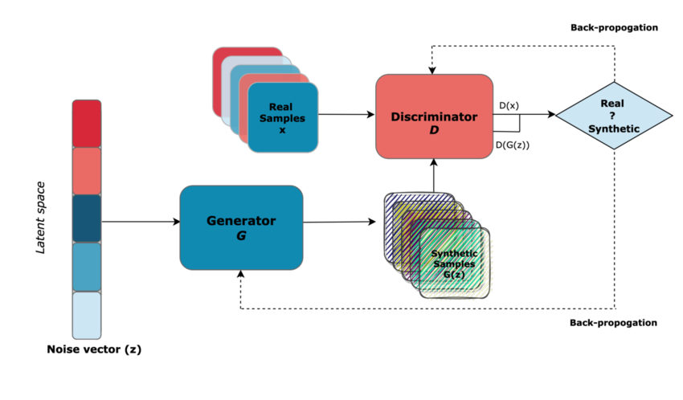
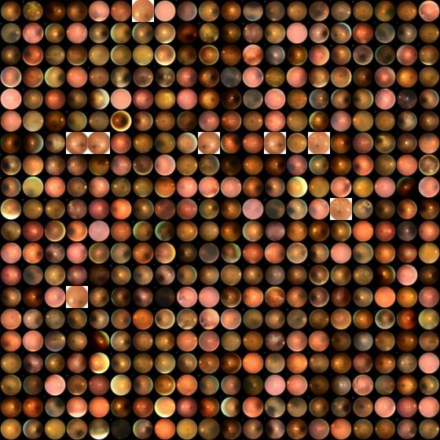
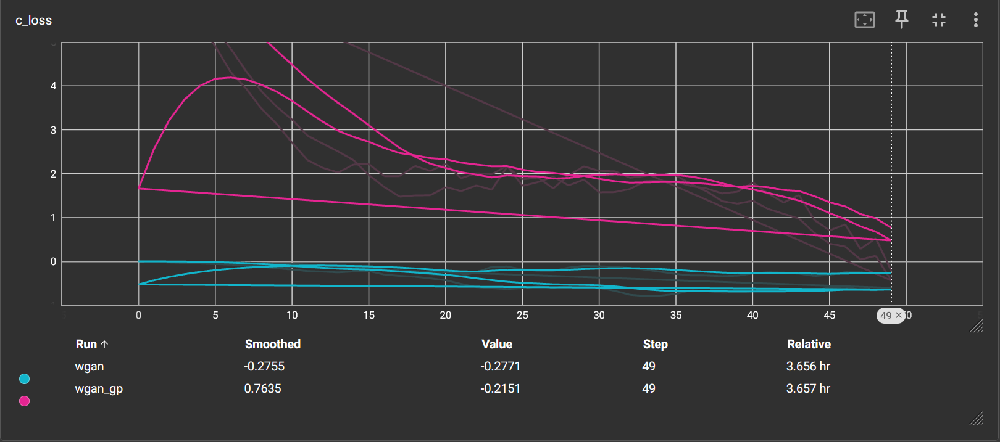
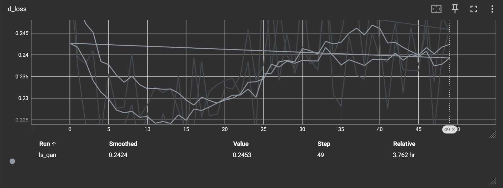
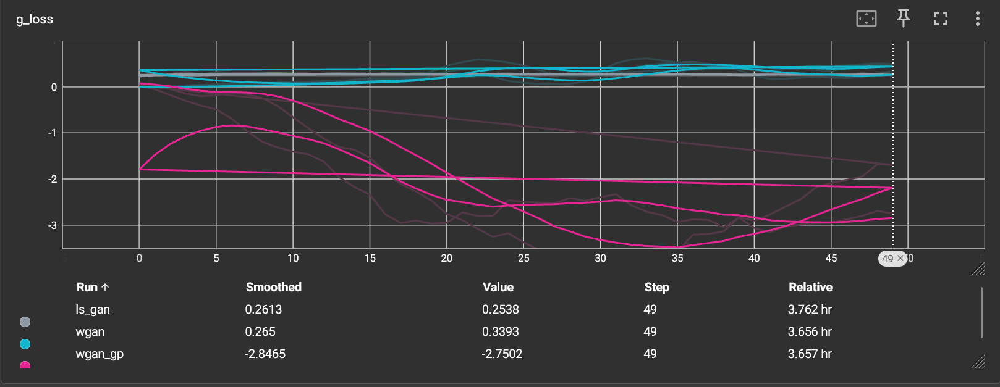

# Unveiling the Magic of GANs with RetinaMNIST: A Fun and Interactive Exploration ✨

## Introduction: The World of GANs 🌍

Generative Adversarial Networks (GANs) have taken the world by storm, revolutionizing how we create and synthesize data. Picture this: two neural networks, the **Generator** and the **Discriminator**, in a fierce competition. The Generator creates images, and the Discriminator judges if they are real or fake. Over time, this battle makes both networks better, producing images that are almost indistinguishable from reality. In this post, we’re going to explore three different GAN architectures: **Least Squares GAN (LS-GAN)**, **Wasserstein GAN (WGAN)**, and **WGAN with Gradient Penalty (WGAN-GP)**. We’ll test them out on the **RetinaMNIST** dataset to see which one excels, using performance metrics like **Inception Score (IS)** and **Fréchet Inception Distance (FID)**. Let’s dive in! 🏊‍♂️

## What Makes GANs So Special? 🤖

### GAN Basics: How Do They Work? 🤔

Imagine two neural networks:
- **Generator:** Takes a random noise vector and transforms it into images.
- **Discriminator:** Evaluates if an image is real (from the dataset) or fake (from the Generator).

    

It's like a game of cat and mouse, where the Generator tries to fool the Discriminator, and the Discriminator tries to spot the fakes. This constant push and pull lead to stunning results! 💥

### Why Are GANs So Unique? 🌟

GANs aren’t just another machine learning model. Here's why:
- **Adversarial Training:** Unlike traditional models, GANs evolve dynamically. Both networks push each other to get better, resulting in more accurate data generation.
- **Varied Loss Functions:** Each GAN variant uses a different loss function to shape the learning process. This gives us flexibility in creating the best model for any given task.
- **Creative Potential:** GANs can create art, music, and even medical images! They’re incredibly versatile.

## Let's Talk About the RetinaMNIST Dataset 📸

RetinaMNIST is a dataset designed for medical image generation, and it's part of the larger **MedMNIST** collection.

- **Image Size:** 28×28 pixels.
- **Preprocessing:** Pixel values are normalized to the range **[-1, 1]**.
- **Image Format:** Grayscale images with a single channel (28×28×1).

This dataset serves as a great testing ground for GAN models focused on medical image generation. 💉

    

## Exploring Three Popular GAN Architectures 🔍

### 1. Least Squares GAN (LS-GAN)

The **LS-GAN** brings a twist to traditional GANs by using a least squares loss function. This leads to:
- **Smoother Gradients:** Reducing vanishing gradients for more stable training.
- **Crisper Images:** The smoother gradient flow enhances the quality of the generated images.
- **Architecture:** Multiple convolutional layers with batch normalization help in generating high-quality outputs.

### 2. Wasserstein GAN (WGAN)

The **WGAN** uses the **Wasserstein distance** as its loss function, which quantifies the difference between real and generated data distributions. Key benefits include:
- **Wasserstein Loss:** A meaningful way to measure how much the generated data differs from the real data.
- **Stable Training:** Less prone to issues like mode collapse, which often affects traditional GANs.
- **Critic Architecture:** No batch normalization is used to preserve Lipschitz continuity.

### 3. Wasserstein GAN with Gradient Penalty (WGAN-GP)

The **WGAN-GP** builds on WGAN by adding a **gradient penalty** term:
- **Enforced Lipschitz Continuity:** The gradient penalty ensures smooth training without the need for weight clipping.
- **Improved Stability:** Makes training more stable, though it requires more computational power.
- **Similar Architecture to WGAN:** The main difference is the inclusion of the gradient penalty in the loss function.

## Training Setup 🏋️‍♀️

For this experiment, we used the following training parameters for all models:
- **Epochs:** 50
- **Batch Size:** 64
- **Noise Vector Dimension:** 100
- **Optimizer:** Adam (Learning Rate = 0.0002, β₁ = 0.5)

Additionally, for **WGAN** and **WGAN-GP**, we updated the critic **5 times** for each generator update to ensure robust feedback during training.

## Evaluation Metrics 📊

To measure the performance of our GAN models, we use two key metrics:

### Inception Score (IS)
- **Purpose:** Measures the quality and diversity of generated images.
- **How it works:** A pre-trained classifier assigns class labels to generated images, and the IS is based on the confidence and diversity of these predictions.
- **Interpretation:** Higher IS values indicate better image quality and diversity.

### Fréchet Inception Distance (FID)
- **Purpose:** Compares the distributions of real and generated images.
- **How it works:** It calculates the mean and covariance of features extracted from both real and generated images.
- **Interpretation:** Lower FID values indicate that the generated images closely resemble the real ones in terms of both quality and variety.

## Results and Discussion 📈

Here are the results from our experiments:

- **LS-GAN:** IS ≈ 1.00, FID ≈ 263.34
- **WGAN:** IS ≈ 1.00, FID ≈ 263.34
- **WGAN-GP:** IS ≈ 1.00, FID ≈ 333.25

    
    
    

### Key Insights:
- **Inception Score Similarity:** All models achieved similar IS values, meaning that the overall quality and diversity of the images were on par.
- **FID Differences:** LS-GAN’s lower FID suggests that it generated images closer to the real dataset’s distribution compared to WGAN-GP.
- **Training Stability:** LS-GAN demonstrated smoother training dynamics, likely due to its least squares loss function.

## Conclusion: LS-GAN Takes the Lead! 🏆

Based on our findings, **LS-GAN** stands out as the most reliable architecture for generating realistic retinal images from the RetinaMNIST dataset. Despite the theoretical advantages of **WGAN** and **WGAN-GP**, **LS-GAN** produced more accurate results, especially in terms of FID. This study emphasizes the importance of choosing the right training strategy and architecture for specific tasks.

## What’s Next? 🚀

GAN research is ever-evolving. Here are some exciting avenues to explore:
- **Hybrid Models:** Combining the best features of LS-GAN, WGAN, and others for even better performance.
- **Deeper Networks:** Taking advantage of cutting-edge deep learning techniques to build more complex models.
- **Advanced Training:** Testing alternative regularization methods for more stable and efficient training.
- **New Metrics:** Expanding our evaluation with more specialized metrics for medical image generation.

## References 📚

1. **Heusel, M., Ramsauer, H., Unterthiner, T., Nessler, B., & Hochreiter, S. (2017).** _GANs Trained by a Two Time-Scale Update Rule Converge to a Local Nash Equilibrium_. [Link](https://arxiv.org/pdf/1706.08500)  
2. **Gulrajani, I., Ahmed, F., Arjovsky, M., Dumoulin, V., & Courville, A. (2017).** _Improved Training of Wasserstein GANs_. [Link](https://arxiv.org/pdf/1704.00028)  
3. **Mao, X., Li, Q., Xie, H., Lau, R. Y., Wang, Z., & Paul Smolley, S. (2017).** _Least Squares Generative Adversarial Networks_. [Link](https://arxiv.org/pdf/1611.04076)  
4. **MedMNIST v2:** A Large-Scale Lightweight Benchmark for 2D and 3D Biomedical Image Classification. [Link](https://medmnist.com/)  
5. **A Review of Generative Adversarial Networks for Electronic Health Records: Applications, Evaluation Measures and Data Sources.** [Link](https://www.researchgate.net/publication/359227500_A_review_of_Generative_Adversarial_Networks_for_Electronic_Health_Records_applications_evaluation_measures_and_data_sources/figures?lo=1)  
6. **MedMNIST Data** [link](https://medmnist.com/)

